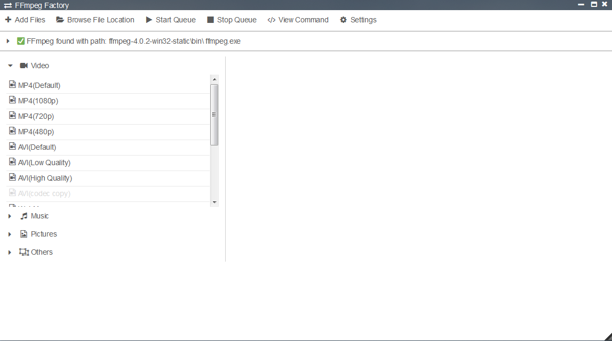
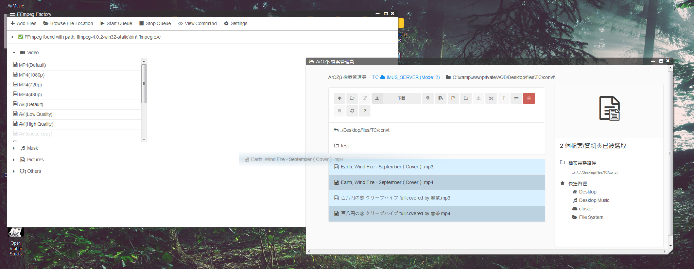

# FFmpeg-Factory
The FFmpeg GUI for the ArOZ Online System

## Installation
The installation instruction below assume you have already got [ArOZ Online System](https://github.com/tobychui/ArOZ-Online-System) installed.

## Demo 
See the system demo in this  

### Manual Installation
1. Install ffmpeg via the command ```sudo apt-get install ffmpeg```. On older version of Debian, you might use libav instead of ffmpeg.
2. Download the repo as a zip file and then unzip the ```module/FFmpeg Factory``` into your ArOZ Online System Root (AOR).
In most cases, the module should be located at ```/var/www/html/AOB/FFmpeg Factory``` after unzip.

### Install via Module Manager (WIP)
1. Copy and paste this Github repo URL into the Module Manager
2. Click Install and wait for the process to finish.

## Screenshots


Main interface for the FFmpeg Factory


Number of task to convert in parallel can be adjusted in the Setting menu.



To add file, either click the "Add File" button on the menu bar or drag and drop files from File Explorer into the FFmpeg interface.

## License
MIT. See the LICENSE file for more information.
*FFMpeg is not part of this project. Please refer to the [FFmpeg Github repo](https://github.com/FFmpeg/FFmpeg) for more information.*
